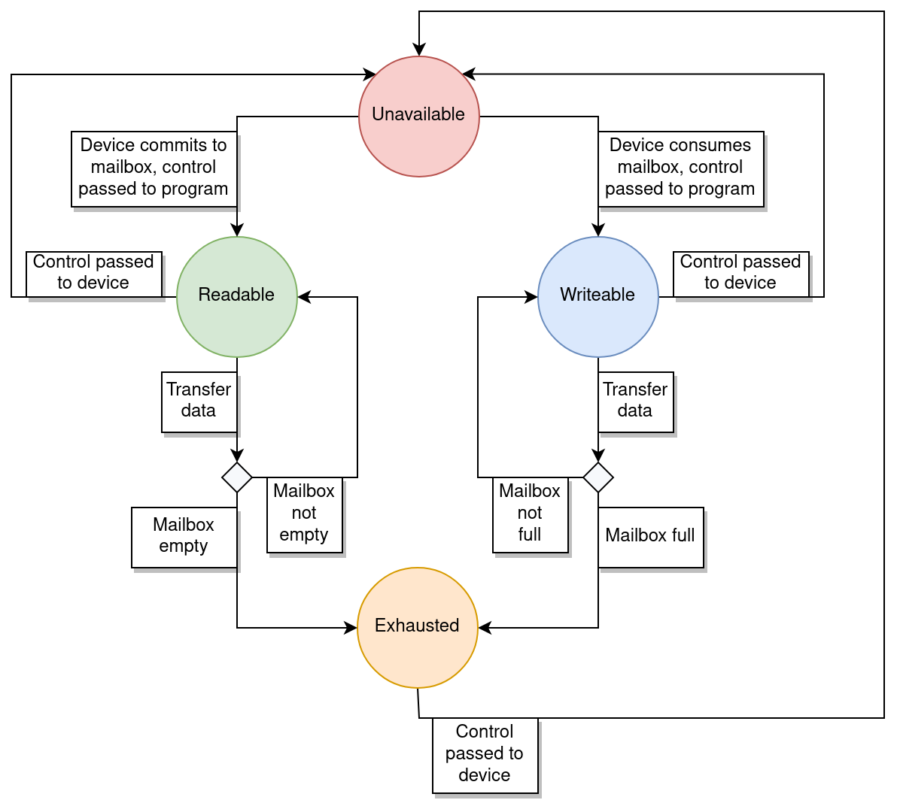
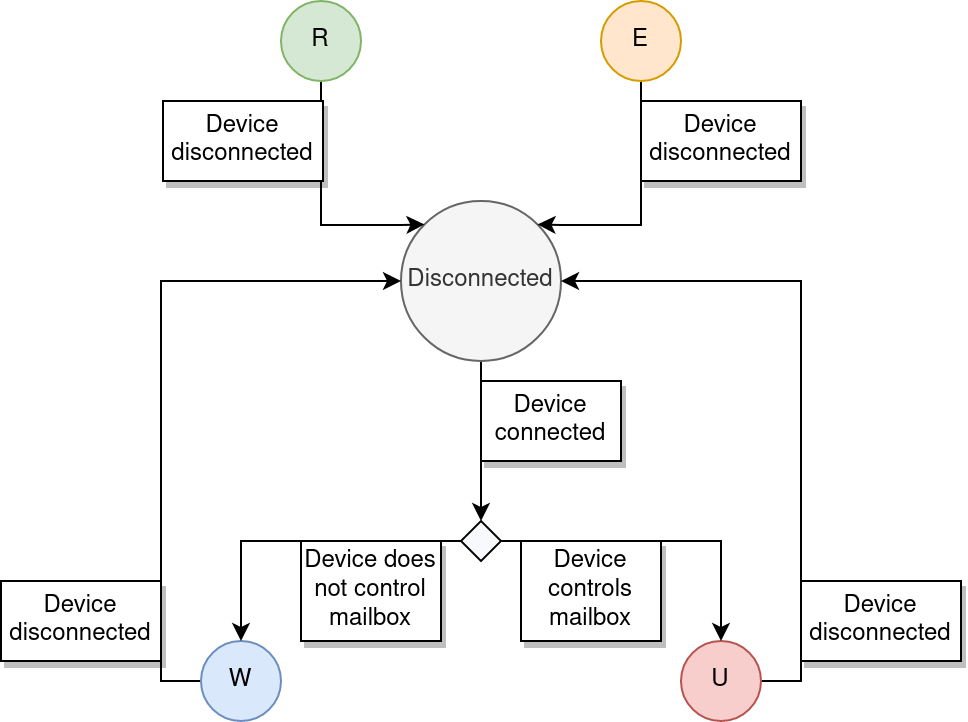

V2MP
====

V2MP is an acronym for the Vesper Virtual Micro Processor. This virtual processor is designed to be very simple, with a small set of instructions, and to live within a virtual environment managed by a host machine (referred to as the "supervisor").

The specification for the virtual processor is outlined in this file.

* [Documentation Conventions](#documentation-conventions)
* [CPU](#cpu)
* [Memory Model](#memory-model)
* [Device Ports](#device-ports)
* [Instruction Set](#instruction-set)
  * [0h ADD: Add](#0h-add-add)
  * [1h SUB: Subtract](#1h-subtract-sub)
  * [2h ASGN: Assign](#2h-assign-asgn)
  * [3h SHFT: Bit Shift](#3h-bit-shift-shft)
  * [4h BITW: Bitwise Operation](#4h-bitwise-operation-bitw)
  * [5h CBX: Conditional Branch](#5h-conditional-branch-cbx)
  * [6h LDST: Load/Store](#6h-loadstore-ldst)
  * [7h DPQ: Device Port Query](#7h-device-port-query-dpq)
  * [8h DPO: Device Port Operation](#8h-device-port-operation-dpo)
    * [Usable Byte Count](#usable-byte-count-00b)
    * [Relinquish Mailbox](#relinquish-mailbox-01b)
    * [Read](#read-10b)
    * [Write](#write-11b)
  * [Fh HCF: Halt](#fh-halt-hcf)
* [Faults](#faults)

## Documentation Conventions

This documentation uses the following conventions when describing the functionality of the processor.

### Numeric Literals

All numeric literals are specified in base 10 by default. Suffixes on numeric literals indicate a different base:

* `h` indicates that the number is in base 16 (hexadecimal). `10h` == `16`.
* `b` indicates that the number is in base 2 (binary). `10b` == `2`.

If a bit is described as being "set" then this means its value is `1`. If a bit is described as being "cleared" then this means its value is `0`.

### Numeric Sign

When values are referred to as "signed", this means that the signed value is represented using two's complement over the specified number of bits, unless otherwise stated.

### Bit Indexing

Instruction and register bits are numbered starting from `0` and proceeding right to left. A specific bit, or range of bits, in a register or instruction are referred to using square brackets `[ ]`. If the bits are present in a register, the name of the register may also be prefixed to the brackets.

For example, `[0]` indicates bit `0` in some unspecified register or instruction. `R0[5 2]` indicates a range of bits in register `R0`, beginning at bit `5` on the left, and ending at bit `2` on the right (both bits `5` and `2` are included in this range).

In certain cases (such as for the status register `SR`), specific bits are named. In this case, the letter used to identify that specific bit may be enclosed in square brackets. For example, `SR[C]` specifies the `CARRY` status bit in the status register.

### Bit Layout

The layout of bits in instructions and registers is represented visually by simple layout diagrams.

```
           V Bit [15]
Register: |................|
                          ^ Bit [0]

              V--V Opcode [15 12]
Instruction: |....|............|
                   ^----------^ Operands [11 0]
```

Certain bits may be substituted by letters, to indicate the positions of various elements of an instruction or register. Bits that are not directly used by a certain instruction or register are indicated by `.`, and unless otherwise specified should always be `0`.

```
Instruction: |0101|AABC........|
                   ^-^^ Three operands A, B, and C indicated here
```

## CPU

The CPU is 16-bit and little-endian. It contains the following registers:

* A program counter (`PC`)
* A status register (`SR`)
* A link register (`LR`)
* Two general-purpose registers (`R0` and `R1`)

The processor also contains an "instruction register" (`IR`) which holds the current instruction as it is decoded, but this cannot be manipulated during operation. It is mainly useful for debugging, as it is preserved if a fault is raised.

### Program Counter (`PC`)

The program counter points to the next instruction in code memory. Its value must always be aligned to a word boundary (ie. `PC[0]` must be `0`), or an [`ALGN`](#faults) fault will be raised when the instruction it points to is fetched.

The program counter is automatically incremented after the execution of each instruction, unless the instruction wrote to the program counter. In this case, the value of the program counter is assumed to point to the next instruction, so no increment takes place.

### Status Register (`SR`)

The status register holds flags relating to the result of the execution of the previous instruction. It cannot be accessed directly by instructions, but its state is used to affect the operation of certain instructions (eg. for conditional branching).

Before each instruction, all register bits are set to `0`. After the instruction, one or more bits may be set to `1` based on the result of the instruction.

```
|..............CZ|
```

The contents of the register are as follows:

* Bit `[0]`, or `SR[Z]`, is the `ZERO` bit. This bit is set to `1` to indicate the absence of a result after an instruction is executed, or is set to `0` otherwise.
  * For arithmetic instructions, if this bit is set to `1` then it indicates that the result of the instruction was zero.
  * For other instructions, a value of `1` may indicate for example that some requested device or state was not available.
* Bit `[1]`, or `SR[C]`, is the `CARRY` bit. This bit is set to `1` if the previous instruction resulted in an overflow or an underflow, or is set to `0` otherwise.
* Bits `[15 2]` are reserved for future use, and are always set to `0`.

Any instructions that may affect the state of the status register will describe the nature of the state changes. Additionally, any instructions that operate based on the current state of the status register will describe how the state is used.

### Link Register (`LR`)

The link register is used by certain instructions to refer to an address memory. Instructions which make use of the link register will describe the nature of its use.

Outside of these instructions, the link register can also be used as a general-purpose register if desired.

### General-Purpose Registers (`R0` and `R1`)

The general-purpose registers do not have any special significance for most instructions - they are simply used to manipulate values. Any instructions that use `R0` or `R1` in specific ways will explain the nature of their use.

## Memory Model

The CPU addresses two separate memory segments: the read-only code segment (`CS`) and the read-write data segment (`DS`). The program counter's address **always** refers to the code segment, and instructions to read from or write to memory **always** refer to the data segment. This means that under this memory model, code cannot be executed from RAM, and data for use in general-purpose registers cannot be directly loaded from the code segment. Some instructions, however, do support packing numerical literals into their operand bits, and these can affect the values in general-purpose registers.

```
        CS                                          DS
+----------------+                          +----------------+
|................| <- |.......PC.......|    |................|
|................|    |.......LR.......| -> |................|
|................|    |.......R0.......| -> |................|
|................|    |.......R1.......| -> |................|
+----------------+                          +----------------+
```

Each memory segment lives in a 16-bit address space, and so can hold a maximum of 65536 bytes (64KB). A program that runs on the V2MP CPU consists of the `CS` and `DS` segments, where the `CS` segment holds all code for the program, and the `DS` segment holds any pre-compiled data that the program may wish to use. It is completely up to the program in question how the `DS` data is managed - any data originally supplied within `DS` may be modified.

The following restrictions apply to any memory access (either in `CS` or `DS`), via any register (`PC` or general-purpose):

* When accessing a unit of memory (eg. a 2-byte word), the address of the access must be aligned to a multiple of the size of the unit. If this is not the case, an [`ALGN`](#faults) fault will be raised.
  * Although the processor itself can only load and store individual words using the [`LDST`](#6h-loadstore-ldst) instruction, other instructions such as [`DPO`](#8h-device-port-operation-dpo) can access memory segments at single-byte granularity. As such, alignment restrictions do not apply to these operations.
* The address of the access must be within the size of the segment. Although 64KB of memory from each segment is addressable, the entire memory space might not be used if the program is not that large, and so will not be allocated by the supervisor. If access is attempted to a memory address outside of either segment, a [`SEG`](#faults) fault will be raised.

The V2MP memory model does not directly support dynamic memory allocation: memory segments are of a fixed size. However, supervisor calls may be used to manipulate memory pages themselves at runtime, eg. to swap one page out for another.

### Relevant Instructions

The [`LDST`](#6h-loadstore-ldst) instruction loads or stores single words from or to `DS`. The [`DPO`](#8h-device-port-operation-dpo) instruction can transfer data between a device port and an address in `DS`.

The [`CBX`](#5h-conditional-branch-cbx) instruction makes reference to an address in `CS` which the program counter `PC` should be set to if the branch condition is met. Other arithmetic instructions may directly modify the contents of `PC` to point to different addresses in `CS`.

## Device Ports

V2MP programs can communicate with other devices in the system using device ports. These are identified using a 16-bit address and numbered starting from `0`. Port `0` is the supervisor request port, and is always attached to the supervisor device; other ports may or may not be attached to devices.

### Mailboxes

Each port contains a mailbox. The mailbox has space for a certain number of bytes, and is used to perform half-duplex communications with the device on the port. The format of the messages between the program and the device depends entirely on what the device expects.

The program can query the number of bytes currently available in a device's mailbox, either for reading or for writing. If required, a device may change the size of its mailbox dynamically at runtime, though this is not recommended without the device first informing the program. The mailbox is at all times expected to be large enough to accommodate any single, complete message - messages whose sizes are larger than the maximum space in the mailbox are not supported.

### State

All descriptions of state in this section describe the state as seen from the program's point of view (ie. as reported by a [`DPQ`](#8h-device-port-query-dpq) instruction).

If a device port has no device attached to it, it is considered "disconnected". A disconnected port may not be operated on using a [`DPO`](#8h-device-port-operation-dpo) instruction; if this occurs, an [`IDO`](#faults) fault will be raised.

If a port does have a device attached to it, it is considered "connected".

A connected port's mailbox is controlled either by the running program or by the device. If the mailbox is controlled by the device, the mailbox's state is considered "unavailable", and the program is not allowed to perform any operations on the mailbox using the [`DPO`](#8h-device-port-operation-dpo) instruction. If the [`DPO`](#8h-device-port-operation-dpo) instruction is used on an unavailable mailbox, an [`IDO`](#faults) fault will be raised.

Note that if a port is disconnected, its mailbox is always considered unavailable.

If a connected port's mailbox is controlled by the program, it may be in one of three exclusive states:

* **Readable**: there is at least one byte in the mailbox that has not yet been read by the program.
* **Writable**: there is at least one byte of free space in the mailbox that has not yet been written to by the program.
* **Exhausted**: depending on the previous state, either all the bytes have been consumed from the mailbox by the program, or all available bytes in the mailbox have been written to by the program. All ongoing data transfers must have completed before a mailbox can move to an exhausted state.

Once a mailbox becomes exhausted, the program may not initiate any more data transfers in either direction. If a data transfer is attempted on an exhausted mailbox, an [`IDO`](#faults) fault will be raised. The program should pass control of an exhausted mailbox back to the device.

When control of the mailbox is passed back to the device, the mailbox reverts to being unavailable. The device is able to either consume the message that was written to the mailbox by the program, or write its own message into the mailbox for the program. It may do neither of these straight away, but must leave the mailbox in either a readable or writable state when control of the mailbox is passed back to the program.

When the program passes control of the mailbox to the device, it may do so from any of the readable, writable, or exhausted states. However, if an indirect data transfer is in progress into or out of the mailbox, actual control of the mailbox is not passed to the device until the data transfer has finished. In this interim time, the supervisor retains control of the mailbox.

If the program passes control of a readable mailbox back to the device, or the device passes control of a writable mailbox to the program, any remaining bytes in the mailbox are discarded by the supervisor before control of the mailbox is transferred.

### Data Transfer

Two methods of data transfer are supported when reading from or writing to a device port mailbox:

* **Direct data transfer**: a single word from a CPU register is written to the mailbox, or a single word from the mailbox is read into a CPU register. This data transfer always completes in one clock cycle.
* **Indirect data transfer**: given a memory address and a maximum number of bytes, both of which are held in CPU registers, one or more bytes are either read from the mailbox into the specified `DS` address, or written from the specified `DS` address into the mailbox. The data transfer is performed by the supervisor, and may take more than one clock cycle.

If an indirect data transfer is in progress into or out of a mailbox, the mailbox is considered "busy". No new data transfers of any kind may be initiated on a mailbox while it is busy, or an [`IDO`](#faults) fault will be raised. Because of this, an unavailable or exhausted mailbox is never considered busy.

When passing a message using indirect data transfer, it is assumed that a memory buffer of at least the specified size is present in `DS` at the given address. Until the indirect data transfer has completed, accessing this buffer in any way may cause undefined behaviour.

### State Diagram

The following diagram describes the state transitions allowed for a port's mailbox when the port is connected to a device.



### Connected State Diagram

The following diagram describes the state transitions allowed when a device is connected to or disconnected from a port.

A transition to a disconnected state may only happen if the port's mailbox is not being controlled by the program. Once control is handed back to the device its status is checked, and the port falls back to being disconnected if there is no longer a device attached.



### Relevant Instructions

The [`DPQ`](#7h-device-port-query-dpq) and [`DPO`](#8h-device-port-operation-dpo) instructions are used to respectively query a device port's state, and to perform an operation on a device port.

## Instruction Set

As the V2MP CPU is 16-bit, each instruction is also comprised of 16 bits. The highest 4 bits represent the opcode, and the other bits represent operands.

```
      Bits [15 12] represent the opcode
      V--V
High |CCCC|DDDDDDDDDDDD| Low
           ^----------^
           Bits [11 0] represent the operands (instruction-specific)
```

Operand bits in register diagrams are assigned letters based on which operands they correspond to. Operand bits represented by `.` are not used by the instruction, and **must** be set to `0`. If this is not the case, a [`RES`](#fault) fault is raised.

Some instructions make reference to a register in the CPU using a 2-bit identifier as an operand. Whenever one of these identifiers is used, it refers to the following register unless otherwise stated:

* `00b` refers to `R0`.
* `01b` refers to `R1`.
* `10b` refers to `LR`.
* `11b` refers to `PC`.

### `0h`: Add (`ADD`)

Increments the value in a register.

```
 ADD
|0000|AABBCCCCCCCC|
```

* Operand bits `[11 10] (A)` specify the two-bit identifier of the register to use as the source.
* Operand bits `[9 8] (B)` specify the two-bit identifier of the register to use as the destination.

If the source `A` and destination `B` register identifiers are different, the source register's value is used to increment the destination register, and the source register remains unchanged. Operand bits `[7 0] (C)` must be set to `0` in this case, or a [`RES`](#faults) fault will be raised.

If instead the source `A` and destination `B` register identifiers are the same, operand bits `[7 0] (C)` are interpreted as an unsigned 8-bit literal, which is used to increment destination register.

Note that if the destination register is `PC`, the increment (either as a literal or from a register) is treated as the number of **words** to increment by, rather than the number of bytes. This is to avoid causing an address mis-alignment by setting `PC` to an odd value.

If the add operation overflows the destination register, `SR[C]` is set; otherwise, it is cleared.

If the add operation results in a value of `0` in the destination register, `SR[Z]` is set; otherwise, it is cleared.

All other bits in `SR` are always cleared.

A useful aspect to note is that an all-zero instruction word corresponds to the instruction "add zero to register `R0`". This can be used as a "nop" instruction.

### `1h`: Subtract (`SUB`)

Decrements the value in a register.

```
 SUB
|0001|AABBCCCCCCCC|
```

* Operand bits `[11 10] (A)` specify the two-bit identifier of the register to use as the source.
* Operand bits `[9 8] (B)` specify the two-bit identifier of the register to use as the destination.

If the source `A` and destination `B` register identifiers are different, the source register's value is used to decrement the destination register, and the source register remains unchanged. Operand bits `[7 0] (C)` must be set to `0` in this case, or a [`RES`](#faults) fault will be raised.

If instead the source `A` and destination `B` register identifiers are the same, operand bits `[7 0] (C)` are interpreted as an unsigned 8-bit literal, which is used to decrement destination register.

Note that if the destination register is `PC`, the decrement (either as a literal or from a register) is treated as the number of **words** to decrement by, rather than the number of bytes. This is to avoid causing an address mis-alignment by setting `PC` to an odd value.

If the subtraction operation underflows the destination register, `SR[C]` is set; otherwise, it is cleared.

If the subtraction operation results in a value of `0` in the destination register, `SR[Z]` is set; otherwise, it is cleared.

All other bits in `SR` are always cleared.

### `2h`: Assign (`ASGN`)

Assigns a value to a register.

```
 ASGN
|0010|AABBCCCCCCCC|
```

* Operand bits `[11 10] (A)` specify the two-bit identifier of the register to use as the source.
* Operand bits `[9 8] (B)` specify the two-bit identifier of the register to use as the destination.

If the source `A` and destination `B` register identifiers are different, the source register's value is copied to the destination register, and the source register remains unchanged. This behaviour is the same regardless of the destination register. Operand bits `[7 0] (C)` of the instruction must be set to `0` in this case, or a [`RES`](#faults) fault will be raised.

Assigning to the program counter `PC` (`11b`) is equivalent to performing an unconditional jump. Beware assigning a value that is not aligned to a word boundary. If an assignment like this is performed, an [`ALGN`](#faults) fault will be raised upon fetching the next instruction.

If instead the source `A` and destination `B` register identifiers are the same, operand bits `[7 0] (C)` of the instruction are interpreted as a signed 8-bit literal to assign to the destination register. The behaviour of the assignment depends on the destination register.

If `A` and `B` are the same and the destination register is `R0`, `R1` or `LR`, the following assignment is performed:

* Bits `[6 0]` in the destination register are assigned the operand bits `[6 0]`.
* Bits `[15 7]` in the destination register are set to `0` if operand bit `[7]` was `0`; otherwise, bits `[15 7]` in the destination register are set to `1`.

```
 R0, R1, or LR, assigning operand 00000010b (2):
|0000000000000010|

 R0, R1, or LR, assigning operand 10000010b (-126):
|1111111110000010|
```

If `A` and `B` are the same, `PC` may not be assigned to, since the range of values that are passed in operand bits `[7 0] (C)` is too small to be useful. If `A` and `B` are the same and the register index `11b` is specified, an [`INO`](#faults) fault is raised.

In all cases described for this instruction, `SR[Z]` is set if the eventual value in the destination register is zero; otherwise, it is cleared. All other bits in `SR` are cleared.

### `3h`: Bit Shift (`SHFT`)

Shifts the bits in a register left or right.

```
 SHFT
|0011|AABB...CCCCC|
```

* Operand bits `[11 10] (A)` specify the two-bit identifier of the register whose value determines the magnitude of the shift. The contents of the register are treated as a signed 16-bit value.
* Operand bits `[9 8] (B)` specify the two-bit identifier of the register whose value will be shifted.

If both register identifiers `A` and `B` are the same, operand bits `[4 0] (C)` are used to determine the magnitude of the shift. The magnitude is treated as a signed 5-bit number, ranging from `-16` to `15`.

If register identifiers `A` and `B` are different, operand bits `[4 0] (C)` must be set to `0`, or a [`RES`](#faults) fault will be raised.

In all cases, operand bits `[7 5]` are reserved for future use, and must be set to `0`. If this is not the case, a [`RES`](#faults) fault will be raised.

When shifting bits, a negative magnitude implies a right shift (dividing the value by 2), and a positive magnitude implies a left shift (multiplying the value by 2). Bits that are shifted off either end of the register are discarded, and bits that are inserted into the register due to the shift are always `0`.

If after the operation the remaining value in the register is zero, `SR[Z]` is set to `1`; otherwise, it is set to `0`. Additionally, if any `1` bits were shifted off the end of the register during the operation, `SR[C]` is set to `1`; otherwise, it is set to `0`. All other bits in `SR` are set to `0`.

### `4h`: Bitwise Operation (`BITW`)

Performs a bitwise operation between two register values.

```
 BITW
|0100|AABBCCD.EEEE|
```

* Operand bits `[11 10] (A)` specify the two-bit identifier of the register to use as the source of the bit mask.
* Operand bits `[9 8] (B)` specify the two-bit identifier of the register to use as the destination.
* Operand bits `[7 6] (C)` specify the type of bitwise operation to perform:
  * `00b` performs a bitwise `AND`.
  * `01b` performs a bitwise `OR`.
  * `10b` performs a bitwise `XOR`.
  * `11b` performs a bitwise `NOT` (ie. flips all bits).

If the source `A` and destination `B` register identifiers are different, the source register's value is used as the bit mask that is used to manipulate the bits in the destination register. In the case of a bitwise `NOT` operation (which does not require a bit mask), the identifier for the source register is ignored.

If the source `A` and destination `B` register identifiers are different, operand bits `[5] (D)` and `[3 0] (E)` are reserved for future use, and must be set to `0`. If they are not, a [`RES`](#faults) fault will be raised.

If instead the source `A` and destination `B` register identifiers are the same, the bit mask is not based on the value in a register. Instead, it is created based on a mask value of `0000000000000001b` which is manipulated by operand bits `[5] (D)` and `[3 0] (E)`:

* Operand bits `[3 0] (E)` specify the magnitude of the left shift of the mask value, in the range `0` to `15` inclusive. For example, if the operand bits `[3 0] (E)` are set to `0101b` (a shift of `5`), this creates the mask `0000000000100000b`.
* Operand bit `[5] (D)` specifies if the resulting mask should be inverted. If operand bit `[5] (D)` is `0` then the mask is not inverted; if it is `1` then the mask is inverted. The above example would be `1111111111011111b` if operand bit `[5] (D)` was `1`.

Similarly to the earlier case where register identifiers `A` and `B` were different, if the bitwise operation is `NOT` then the generated bit mask is redundant. In this case, operand bits `[3 0] (E)` must be set to `0`, or a [`RES`](#faults) fault will be raised.

In all cases, operand bit `[4]` is reserved for future use, and must be set to `0`. If this is not the case, a [`RES`](#faults) fault will be raised.

If the resulting value in the destination register is zero, `SR[Z]` is set to `1`; otherwise, it is set to `0`. All other bits in `SR` are set to `0`.

### `5h` Conditional Branch (`CBX`)

Decided whether or not to modify the value of the program counter `PC`, depending on the current state of the status register `SR`.

```
 CBX
|0101|AB..CCCCCCCC|
```

* Operand bit `[11] (A)` specifies how the value of `PC` should be modified:
  * If `A` is `1`, the value in `LR` is treated as the address to jump to, and is assigned to `PC`. In this case, operand bits `[7 0] (C)` must be set to `0`; if they are not, a [`RES`](#faults) fault will be raised.
  * If `A` is `0`, the value of operand bits `[7 0] (C)` is treated as a signed 8-bit offset **in words** from the current `PC` address. `PC` is incremented (or decremented, depending on the sign) by this value.
* Operand bit `[10] (B)` specifies what aspect of `SR` is considered when deciding whether to branch.
  * If `B` is `0`, `SR[Z]` is considered. If `SR[Z]` is set (ie. the last instruction that was executed produced a result of zero), `PC` is modified according to the rules above. If `SR[Z]` is not set, `PC` is not modified and will be incremented as normal once the `CBX` instruction is complete.
  * If `B` is `1`, `SR[C]` is considered. If `SR[C]` is set (ie. the last instruction that was executed overflowed or underflowed its register), `PC` is modified according to the rules above. If `SR[C]` is not set, `PC` is not modified and will be incremented as normal once the `CBX` instruction is complete.

Operand bits `[9 8]` are reserved for future use, and must be set to `0`. If this is not the case, a [`RES`](#faults) fault will be raised.

After this instruction, `SR[Z]` will be set to `1` if the condition was not met. If the condition was met, and `PC` was set, `SR[Z]` will be set to `0`. All other bits in `SR` will be set to `0`.

### `6h`: Load/Store (`LDST`)

Depending on the operands, either loads a value from a location in memory, or stores a value to a location in memory.

```
 LDST
|0110|ABB.........|
```

* Operand bit `[11] (A)` specifies the mode of the operation:
  * `0b` means that the operation is a load.
  * `1b` means that the operation is a store.
* Operand bits `[10 9] (B)` specify the two-bit identifier of the register whose value will be used for the operation.

The memory location for the load or store is always specified by the value of `LR`. This always refers to the data segment `DS`.

Operand bits `[8 0]` of the instruction are reserved for future use. If any of these bits is not `0`, a [`RES`](#fault) fault will be raised.

If the memory address specified by `LR` is not aligned to a word boundary, an [`ALGN`](#faults) fault will be raised. If the address is not within the boundaries of `DS`, a [`SEG`](#faults) fault will be raised.

If the value that is loaded or stored to or from the register is zero, `SR[Z]` is set; otherwise, it is cleared. All other bits in `SR` are always cleared.

### `7h` Device Port Query (`DPQ`)

Queries the state of a device communications port, and sets the status register `SR` appropriately.

```
 DPQ
|0111|.........AAA|
```

The number of the port to be queried is held in `R0`. Additionally, operand bits `[2 0] (A)` specify the type of query to perform:

* If operand bits `[2 0] (A)` are set to `000b (0h)`, the instruction queries the connected state of the port - ie. whether there is a device currently attached to the port.
* If operand bits `[2 0] (A)` are set to `001b (1h)`, the instruction queries whether the port's mailbox is readable and not busy - ie. whether a data transfer can be initiated from the mailbox.
* If operand bits `[2 0] (A)` are set to `010b (2h)`, the instruction queries whether the port's mailbox is writable and not busy - ie. whether a data transfer can be initiated to the mailbox.
* If operand bits `[2 0] (A)` are set to `011b (3h)`, the instruction queries whether the port's mailbox is exhausted - ie. whether control of the mailbox should be passed back to the device.
* If operand bits `[2 0] (A)` are set to `100b (4h)`, the instruction queries whether the port's mailbox is busy - ie. whether a data transfer is currently in progress. This query is useful to determine whether the data transfer buffer in memory should currently be considered off-limits for the CPU to access.
* If operand bits `[2 0] (A)` are set to `101b (5h)`, the instruction queries whether the port's mailbox is under the program's control - ie. whether it is readable, writable, or exhausted. The mailbox's busy state does not affect the result of the query. This query is equivalent to asking whether the port's mailbox is _not_ unavailable.

Values `110b (6h)` and `111b (7h)` are reserved. If operand bits `[2 0] (A)` are set to any of these values, a [`RES`](#faults) fault will be raised.

Operand bits `[11 3]` in the instruction word are reserved, and must be set to `0`. If this is not the case, a [`RES`](#faults) fault will be raised.

After the instruction is executed, `SR[Z]` is set based on the query type. The convention followed is to set `SR[Z]`, as the "zero" status bit, to indicate the _absence_ of the state being queried for. Therefore, conditionally branching on the presence of `SR[Z]` implies "branch on failure" - that the `PC` jump occurs if the state queried for was _not_ present. If `SR[Z]` is cleared, this implies success - that the state queried for _was_ present.

* If `A` is `000b (0h)`, `SR[Z]` will be set if there _is not_ a device attached to the port, and will be cleared if there _is_ a device attached.
* If `A` is `001b (1h)`, `SR[Z]` will be set if the port's mailbox was readable but busy, or if it was not readable at all. `SR[Z]` will be cleared if the port's mailbox was readable and not busy.
* If `A` is `010b (2h)`, `SR[Z]` will be set if the port's mailbox was writable but busy, or if it was not writable at all. `SR[Z]` will be cleared if the port's mailbox was writable and not busy.
* If `A` is `011b (3h)`, `SR[Z]` will be set if the port's mailbox _was not_ exhausted, and will be cleared if it _was_ exhausted. Note that if the mailbox was not exhausted, it could be in any other state, including unavailable.
* If `A` is `100b (4h)`, `SR[Z]` will be set if the port's mailbox _was not_ busy, and will be cleared if it _was_ busy.
* If `A` is `101b (5h)`, `SR[Z]` will be set if the port's mailbox _was not_ under the program's control (ie. the device had control), and will be cleared if it _was_ under the program's control.

All other bits in `SR` will be set to `0`.

### `8h` Device Port Operation (`DPO`)

Performs an operation on a device communications port.

```
 DPO
|1000|A.........BB|
```

The number of the port to use is held in `R0`. Operand bit `[11] (A)` is used to specify the type of data transfer used for a read or a write:

* If operand bit `[11] (A)` is `0`, this means that a read or write will be performed using **direct data transfer**.
* If operand bit `[11] (A)` is `1`, this means that a read or write will be performed using **indirect data transfer**.

Additionally, operand bits `[1 0] (B)` are used to specify the type of operation that will take place:

* If operand bits `[1 0] (B)` are set to `00b (0h)`, the usable byte count is fetched.
* If operand bits `[1 0] (B)` are set to `01b (1h)`, control of the port's mailbox is relinquished by the program.
* If operand bits `[1 0] (B)` are set to `10b (2h)`, a read is performed.
* If operand bits `[1 0] (B)` are set to `11b (3h)`, a write is performed.

For any operation, operand bits `[10 2]` are reserved for future use, and must be set to `0`. If this is not the case, a [`RES`](#faults) fault will be raised.

If any operation is performed on a device port that is disconnected, an [`IDO`](#faults) fault will be raised.

The different supported operations, specified by operand `B`, are explained below.

#### Usable Byte Count (`00b`)

If operand bits `[1 0] (B)` are set to `00b (0h)`, the operation fetches the number of usable bytes in the mailbox of the device port specified by `R0`. The number of usable bytes is placed into `LR`.

The purpose of the usable bytes depends on whether the mailbox is in a readable or writable state (remember that a mailbox cannot be both readable and writable at the same time).

* If the mailbox is in a readable state, the number of usable bytes corresponds to the number of bytes left to read from the mailbox.
* If the mailbox is in a writable state, the number of useable bytes corresponds to the number of bytes left that can be written to in the mailbox.

If the mailbox is exhausted, the number of usable bytes is `0`.

When the instruction is executed, operand bit `[11] (A)` must be set to `0`. If it is not, a [`RES`](#faults) fault will be raised.

If the operation is attempted when the mailbox is not controlled by the program, the result of the operation is zero.

After the instruction has been executed, `SR[Z]` is set or cleared depending on the number of usable bytes returned. If the number of usable bytes was `0`, `SR[Z]` is set to `1`; otherwise, `SR[Z]` is set to `0`. All other bits in `SR` are set to `0`.

#### Relinquish Mailbox (`01b`)

If operand bits `[1 0] (B)` are set to `01b (1h)`, control of the mailbox of the device port specified by `R0` is relinquished by the program. If the program does not have control of the mailbox when the instruction is executed, nothing happens.

When the instruction is executed, operand bit `[11] (A)` must be set to `0`. If it is not, a [`RES`](#faults) fault will be raised.

After the instruction has been executed, `SR[Z]` is cleared if the program had control of the mailbox initially. `SR[Z]` is set if the program did not have control of the mailbox when the instruction was executed.

#### Read (`10b`)

If operand bits `[1 0] (B)` are set to `10b (2h)`, the operation initiates a read from the mailbox of the device port specified by `R0`. The type of data transfer is set by operand bit `[11] (A)`.

If the operation is attempted when the mailbox is not readable or is busy, an [`IDO`](#faults) fault will be raised.

**Direct Data Transfer**

If operand bit `[11] (A)` is `0`, a direct data transfer is performed for the read. A  little-endian word of data is read from the device port's mailbox and placed into `LR`. If the mailbox only contained one byte of data, the second byte read into `LR` is always `00h`. The number of bytes read (either `1` or `2`) is placed into `R1`.

After the instruction is executed, `SR[Z]` is set if there were two or more bytes in the mailbox at the point the read was executed, and is cleared if there was only one byte in the mailbox when the read was executed.

`SR[C]` is set if there were bytes left to read in the mailbox after the data transfer, and is cleared if there were no more bytes in the mailbox after the data transfer. `SR[C]` is always cleared if `SR[Z]` is cleared.

**Indirect Data Transfer**

If operand bit `[11] (A)` is `1`, an indirect data transfer is initiated for the read. The value of `LR` specifies the address in `DS` to which to copy the data from the device port's mailbox, and the value in `R1` specifies the maximum number of bytes to copy. It is assumed that there is a data buffer at the address pointed to by `LR` which is large enough to hold at least as many bytes as are specified in `R1`. If the supervisor attempts to write off the end of `DS` during the data transfer, a [`SEG`](#faults) fault is raised. Additionally, if `R1` is `0`, an [`IDO`](#faults) fault is raised.

Once the instruction is executed, the mailbox becomes busy, and the supervisor begins copying data out of the mailbox and into the buffer that was pointed to by `LR`. `R1` is set to hold the number of bytes that are being transferred - this may be less than the number originally requested, if this number was greater than the number of bytes left in the mailbox.

While the mailbox is busy, the data buffer originally pointed to by `R1` should not be accessed by the CPU, or undefined behaviour may result. Once the mailbox is no longer busy, the indirect data transfer has ended and the memory may be safely accessed.

After the instruction is executed, `SR[C]` is cleared if the number of bytes being read in the data transfer exactly matches the maximum number of bytes originally specified by `R1`. `SR[C]` is set if the number of bytes being read in the data transfer is less than the maximum number of bytes originally specified by `R1`.

`SR[Z]` is cleared if there will be bytes left to read in the mailbox after the data transfer completes, and is set if there will be no more bytes in the mailbox after the data transfer completes.

#### Write (`11b`)

If operand bits `[1 0] (B)` are set to `11b (2h)`, the operation initiates a write to the mailbox of the device port specified by `R0`. The type of data transfer is set by operand bit `[11] (A)`.

**Direct Data Transfer**

If operand bit `[11] (A)` is `0`, a direct data transfer is performed for the write. A  little-endian word of data is written to the device port's mailbox from `LR`. If the mailbox only has one byte of writable space left, the lower byte of `LR` is written to the mailbox, and the upper byte is discarded. The number of bytes written (either `1` or `2`) is placed into `R1`.

After the instruction is executed, `SR[Z]` is set if there were no more free bytes in the mailbox after the write, and is cleared if there were free bytes still available in the mailbox after the write.

`SR[C]` is set if there were more bytes specified in the write than there were free bytes in the mailbox, and is cleared if the entirety of the write fitted into the mailbox.

**Indirect Data Transfer**

If operand bit `[11] (A)` is `1`, an indirect data transfer is initiated for the write. The value of `LR` specifies the address in `DS` from which to copy the data to the device port's mailbox, and the value in `R1` specifies the maximum number of bytes to copy. It is assumed that there is a data buffer at the address pointed to by `LR` which holds at least as many bytes as are specified in `R1`. If the supervisor attempts to read off the end of `DS` during the data transfer, a [`SEG`](#faults) fault is raised. Additionally, if `R1` is `0`, an [`IDO`](#faults) fault is raised.

Once the instruction is executed, the mailbox becomes busy, and the supervisor begins copying data into the mailbox from the buffer that was pointed to by `LR`. `R1` is set to hold the number of bytes that are being transferred - this may be less than the number originally requested, if this number was greater than the number of free bytes left in the mailbox.

While the mailbox is busy, the data buffer originally pointed to by `R1` should not be accessed by the CPU, or undefined behaviour may result. Once the mailbox is no longer busy, the indirect data transfer has ended and the memory may be safely accessed.

After the instruction is executed, `SR[Z]` is set if there will be no more space left in the mailbox after the write, and is cleared if there will still be at least one byte of space left in the mailbox after the write.

`SR[C]` is set if there were more bytes specified in the write than there were free bytes in the mailbox, and is cleared if the entirety of the write fitted into the mailbox.

### `Fh`: Halt (`HCF`)

Also known as "halt and catch fire". This instruction stops the processor, leaves all registers as they are, and raises an [`HCF`](#faults) fault.

```
 HCF
|1111|AAAAAAAAAAAA|
```

Operand bits `[11 0] (A)` function as an argument to the fault. They do not have any significant meaning to the instruction, but are passed on to the fault handler.

## Faults

The possible faults raised by the processor are described below.

| Index | Code | Name | Description | Triggered By |
| ----- | ---- | ---- | ----------- | ------------ |
| `01h` | `HCF` | Halt and Catch Fire | Raised by the [`HCF`](#fh-halt-hcf) instruction to indicate that the processor has halted. | [`HCF`](#fh-halt-hcf) |
| `02h` | `RES` | Reserved Bits Set | Raised when an instruction is decoded and one or more reserved bits are set to `1`. | Execution of any instruction |
| `03h` | `ALGN` | Alignment Violation | Raised when an unaligned memory address is dereferenced in `CS` or `DS`. | [`LDST`](#6h-loadstore-ldst), or upon fetching the next instruction using `PC`. |
| `04h` | `SEG` | Segment Access Violation | Raised when an address outside `CS` or `DS` is dereferenced. | [`LDST`](#6h-loadstore-ldst), [`DPO`](#8h-device-port-operation-dpo), or upon fetching the next instruction using `PC` |
| `05h` | `IDO` | Invalid Device Operation | Raised when an operation is attempted on a port which is not in the correct state for the operation. | [`DPO`](#8h-device-port-operation-dpo) |
| `06h` | `INI` | Invalid Instruction | Raised when an unrecognised instruction opcode is decoded. | Decoding of an instruction |
| `07h` | `INO` | Invalid Operand | Raised when an invalid combination of operands is provided on an instruction. | Execution of any instruction |
| `08h` | `SPV` | Supervisor Error | Raised if the supervisor encounters an internal error. This fault indicates an exceptional issue with the supervisor code itself, and is not expected to be accommodated by a program. Under normal operation, this fault should never be raised. | Supervisor |

## Todo Notes

### Stack

Do we have enough remaining instructions to implement stack support? We're beginning to need it once we start wanting to check the results of device operations...
